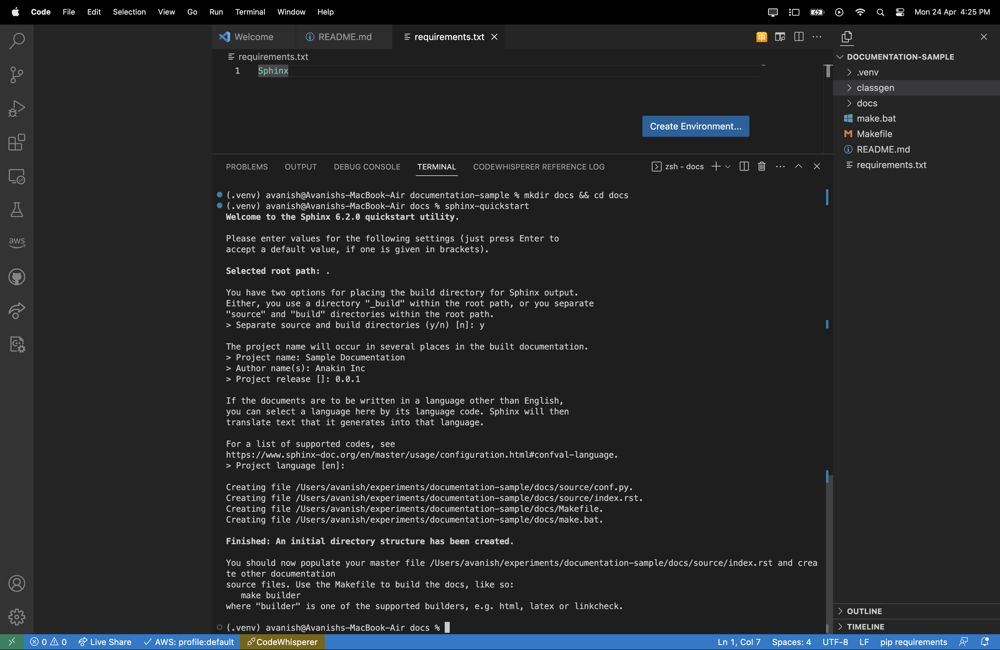
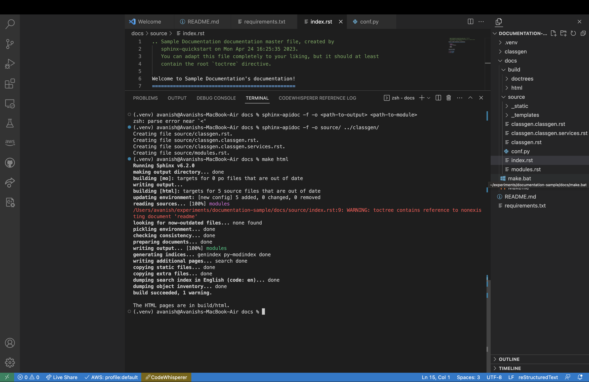

# Classgen module

## Pre requisites

- Python Installation.
- CMake installation.

## Steps

- Complete the module development with in code documentation.

- Optional Steps(but recommended)
- - Create a virtual environment.
- - - python3 -m venv venv
- - Install Sphinx
- - - pip3 install Sphinx
- Install the sphinx. `pip install sphinx`
- Assume that your code structure is as follows:

```
    /repo-root
    |
    |--module
    |----submodule1
    |----submodule2
    |----submodule3
    |--requirements.txt
    |--README.md
    |--[LICENSE]
    |--[pyproject.toml]
    |--[setup.py]
```

- Now you are at `repo-root/`.
- Create a directory named `docs`.
- Move inside `docs`.
- cd `docs`.
- Create a configuration for the documentation.
- On terminal, type `sphinx-quickstart` and hit enter.
- - 
- You can add an optional README.rst in `repo-root/module/`
- 
- To generate the HTML documentation, use `sphinx-apidoc -f -o source/ ../module/`. This will store the `rst` docs in `source` directory inside `docs` folder.


### Sample Docstrings

```Python
Initializes the class generator.
        
        Params:
            name: The name of the class.
            members: A list of members to be added to the class.
            methods: A list of methods to be added to the class.
            constructor: The name of the constructor.
            constructor_args: A list of arguments to be passed to the constructor.

        Returns:
            None

        Examples:
            >>> from classgen import ClassGenerator
            >>> student = ClassGenerator('student', ['name', 'standard', 'dob'])
            <ClassGenerator at 0x107352eb0>
        '''
```

- Single Command build: `clear && sphinx-apidoc -f -o source/ ../classgen/ && make html`
